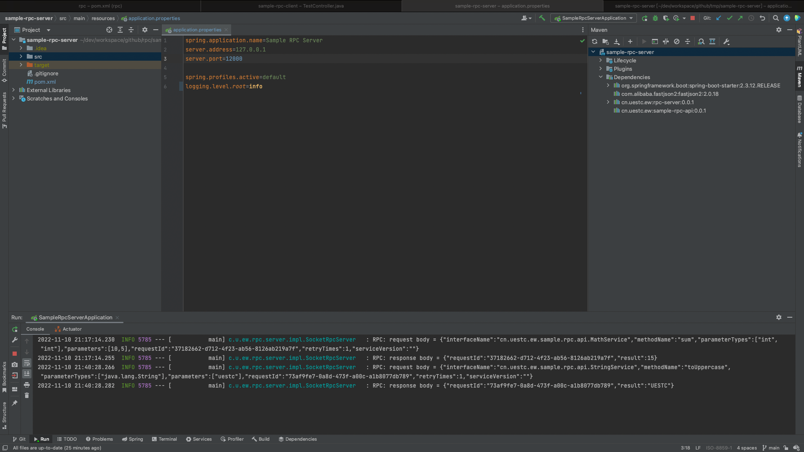

# RPC Simple Framework ( With Samples )

# 一、简介

## 1.1 RPC

以下是摘自维基百科的 RPC 定义：

> 在分布式系统中，远程过程调用（RPC）是指某个计算机程序调用不同地址空间（通常是在不同的计算机上）的另一个过程（或子例程）时，就像普通的（本地）过程调用一样，不需要显式编码远程交互的细节。

也就是说，无论是调用本地还是远程的过程（面向对象编程中通常称为 “方法”），程序员编写的业务代码基本相同。这意味着 RPC 模型具备一定程度的位置透明性，即无论所调用的过程在本地还是远程，它们都大致相同。网络通信、编解码、异构等问题被 RPC 框架封装起来。在面向对象的编程范例如 Java 中，RPC 又叫 RMI（远程方法调用），二者本质是等价的。

RPC 是一个 [请求-响应](https://en.wikipedia.org/wiki/Request–response) 协议。由*客户端*发起，向已知的*远程服务器*发送请求消息，使用提供的参数执行指定的过程。远程服务器向客户端发送响应，应用程序继续其进程。当服务器正在处理调用时，客户端被阻塞（它会等到服务器完成处理后再恢复执行），除非客户端向服务器发送异步请求。RPC 协议本身并不规定这样的实现细节，这也导致了各种不同的 RPC 协议。

上图描述了 RPC 的基本结构和工作流程，涉及到的基本组件如下：

- Client：远程过程调用发起者
- Server：远程过程调用提供者
- Client Stub：请求编码、构建请求体、服务器寻址、序列化请求体、屏蔽通信双方异构
- Server Stub：请求解码、本地调用、构建响应体、序列化响应体、屏蔽通信双方异构
- RPC Runtime：负责对序列化后的请求体/响应体进行网络传输

## 1.2 项目结构

当前仓库包含了多个项目/应用，共分为两部分。第一部分是作为框架基础组件的 `Framework Modules` ，另一部分是由多个应用组成的样例程序，即所有前缀为 `sample-*` 的模块。

此项目已被标记为 dish (trash、garbage、rubbish、shit 的委婉表达) code，即没有实用价值的代码，只是用来熟悉 RPC 的基本流程。

### 1.2.1 Framework Modules

框架模块是去除样例程序的完整可发布的组件包，发布形式为 JAR包，外部项目可通过引入此 JAR 的依赖，使用此框架。 包含如下模块：

- `rpc-common` ：提供基础的 JavaBean 如 Request 、Response、工具类、编解码等
- `rpc-registry` ：提供服务注册和发现相关的功能
- `rpc-client` ：提供给客户端程序使用的依赖
- `rpc-server` ：提供给服务端程序使用的依赖

### 1.2.2 Sample Server

服务端样例，提供一个简单的服务端样例程序，发布形式为独立的 WEB 应用，即需要单独启动。包含如下模块：

- `sample-rpc-api` ：由服务端对外发布的可用服务接口列表
- `sample-rpc-server` ：样例服务端的主程序，注册服务，接收客户端请求并处理

### 1.2.3 Sample Client

客户端样例，提供一个简单的客户端样例程序，发布形式为独立的 WEB 应用，即需要单独启动。包含如下模块：

- `sample-rpc-api` ：**（引用）** 服务端发布的可用服务接口列表
- `sample-rpc-client` ：样例客户端的主程序，发现服务并发起调用

## 1.3 模块依赖

### 1.3.1 整体视图

### 1.3.2 模块间依赖

## 1.4 快速启动

### 1.4.1 作为框架引入（不推荐）

对于只引用依赖，在自己客户端和服务端项目中使用，而不需要运行样例程序的，可直接删除项目内包含 `sample` 的一级文件夹。之后在本地项目根目录下，执行 `mvn clean install` 即可安装到本地仓库。默认使用 `JDK 19` 进行编译。

通常情况下，在本地测试自己的 RPC 客户端与服务器时，客户端只需要 `rpc-client` 模块的依赖，服务端只需要 `rpc-server` 模块的依赖。此外，服务端还需要提供一个可调用的接口包（类似使用 FeignClient 时定义的业务接口），具体可参考 `sample-*`的组织方式。

**备注**：当前框架使用的协议很简单，只在请求体前加上了一个 4B 大小的整型数字，表示请求体大小。而在实际应用中，一般需要根据业务定制化 RPC 协议，约定协议头等。通信基于 Socket BIO，阻塞通信效率低，基本不适合实际使用，当然，可以无侵入改为 Socket NIO、Netty 等但需要额外编码。总之当前项目的主要目的还是以学习 RPC 的思想为主，通过简单的代码了解其基本运行流程。

### 1.4.2 尝试样例程序

1. 启动服务端样例，可以启动多个，但要在配置文件中指定不同的端口
2. 启动客户端样例
3. 触发客户端接口，让其进行远程调用

# 二、概要设计

## 2.1 类图

下图展示了基础组件中的核心类主要属性和方法的设计

## 2.2 时序图

下图展示了一次 RPC 请求所涉及的系统组件交互时序图

## 2.3 部署图

下图展示了理想情况下测试时的部署方案，屏蔽了无关细节，主要关注内容是在分布式场景下的 RPC 工作效果

# 三、详细设计

## 3.1 技术选型

- 注册中心：Zookeeper
- 网络传输：Socket BIO
- 容器：Spring
- 序列化：Protostuff
- 动态代理：CGLIB

## 3.2 协议及序列化

协议规定请求体共包含两部分内容，第一部分固定长度协议头，目前只有 4B 用于表示第二部分的大小（字节），第二部分是变长的 RPC 请求参数，由 `Protostuff` 直接序列化得到。

其中协议头需要手动序列化到请求体中，采用小端法存储，服务端同样使用小端法解析，这样服务端可以知道要读取多少个字节反序列化为 RPC 请求参数。如果有其它需要传递的参数，可以扩展协议头的定义并自定义编码/序列化格式。

## 3.3 超时重试（At-Least-Once）

语义 “至少成功一次”，即客户端发起的一次请求，至少要收到一次 “请求处理成功” 的响应（不是结果成功）。考虑分布式系统中，一次请求的状态可以简化为：

- 稳定
  - 成功：请求正常接收，正常处理
  - 失败：请求正常接收、但服务端参数校验异常、权限非法等
- 不稳定
  - 超时：不知道是否正常接收或处理

成功和失败都可以视为请求处理成功，系统中任一方都清楚有没有问题或者问题出在哪里。但超时不同，出现超时后分布式系统中的参与者将不清楚对方的状态，不知道是自己的参数有问题，还是服务端程序有问题，还是网络繁忙服务端没有收到。

为了让超时状态明确转换到成功或者失败，我们需要在向服务端发起远程调用时，设置超时时间，一旦发现超出超时时间而没有收到响应，就重新发起。结合实际应用场景，重试不应无限执行下去，超出阈值后可将服务标记为不可用，并上报指标或者监控系统。

# 四、测试

运行环境

- OS：MacOS 12.5.1（单机多端口）
- JDK：19
- 客户端：127.0.0.1:11000
- 服务端：127.0.0.1:12000，127.0.0.1:13000
- 中间件
  - Zookeeper：127.0.0.1:12181（Main），127.0.0.1:12182，127.0.0.1:12183

## 4.1 整数运算

1. 客户端发起整数加法请求，传入参数 `a=5, b=10`

   

2. 服务端 2 接收到请求并响应客户端

   

3. 客户端重新请求，服务端 1 接收到请求并响应客户端

   

4. 客户端的两次请求信息

   

## 4.2 浮点数运算

1. 客户端发起浮点数加法请求，传入参数 `a=3.14, b=6.28`

   

2. 服务端 2 收到请求并响应

   

## 4.3 字符串运算

1. 客户端发起字符串大写转换，传入参数 `text=uestc`

   

   

2. 服务端 1 收到请求并响应客户端

   

## 4.4 超时重试

At-Least-Once 测试思路：

1. 服务端定义一个超时接口，请求前 5 次时，每次都会休眠 5s
2. 客户端 Socket 连接的超时时间设置为 5s（加上服务端执行的时间，前 5 次调用必定每次都超时）
3. 客户端配置超时重试策略，重试最大次数设置为 10次
4. 客户端向超时接口发出请求，检测到超时后，按照超时策略重试超时接口，每次重试前都会等待一小段时间。且随着重试次数增多，下次等待开始重试的间隔时间越长（毫秒级指数递增）
5. 重试时不更换路由，是为了测试接口方便。实际使用时可以从服务发现重试，这样尽可能规避掉服务器繁忙或者网络不可达的情况

下面是测试流程截图

1. 客户端

   

   

2. 服务端 1 收到超时重传测试接口，

   

3. 客户端请求记录

   

# 参考

1. [Remote Procedure Call (RPC) Protocol in Distributed System](https://www.guru99.com/remote-procedure-call-rpc.html)
2. [RPC框架原理与实现](https://zhuanlan.zhihu.com/p/469833331)